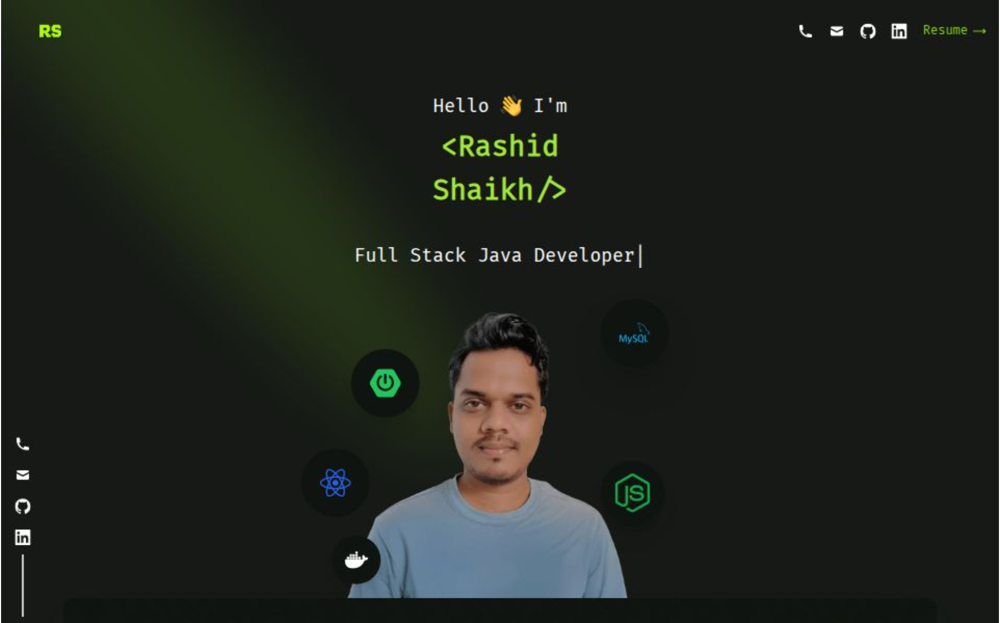

# Rashid Shaikh — Personal Portfolio
<p align="center">  </p> <p align="center"> <a href="https://rashid-shaikh.vercel.app/" target="_blank">  </a>    </p>

A clean and modern personal portfolio built with Next.js, React, and TailwindCSS.
Fully responsive, fast, and deployed on Vercel.

👉 Live Website: https://rashid-shaikh.vercel.app/

## 📚 Table of Contents

- Getting Started
- Analytics (Optional)
- Deploying to Vercel
- General Deployment Guide
- Tech Stack
- Todo
- License

## 🛠️ Getting Started

Clone the repository
```bash 
git clone https://github.com/rashiddshaikh/rashid-shaikh-portfolio
```

Install dependencies
```bash
npm install
or
yarn
```

Add your personal information Update all files inside: -
```bash
src/data/

```
(your bio, experience, projects, social links, etc.)


Add your resume Replace: -
```bash
public/resume.pdf
```

If using a different name, update RESUME_PATH inside: -
```bash
src/utils/env.ts
```

Start the development server
```bash
npm run dev
# or
yarn dev
```

Build for production
```bash
npm run build
# or
yarn build
```

## 📊 Analytics (Optional)

This project supports Ackee (self-hosted, privacy-friendly analytics).

To use analytics:

- Deploy Ackee
- Create a domain inside Ackee
- Update your URLs and domain ID in:
```bash
src/utils/env.ts
```
- To disable analytics:
```bash
Set ENABLE_ANALYTICS = false.
```

## ▲ Deploying to Vercel

Create a GitHub repository: https://github.com/new

Add the GitHub remote:
```bash
- git remote add origin <your-repo-url>
- git push -u origin main
```

Import your repo into Vercel: https://vercel.com/new

Vercel will automatically build and deploy on each push.

## 🌐 General Deployment Guide (Static Export)

In next.config.js, set:
```bash
output: "export"
```

Build the static export:
```bash 
npm run build
```

Upload the /out folder to any static host:

- Firebase Hosting
- Netlify
- GitHub Pages
- Cloudflare Pages

## 🧰 Tech Stack

- ⚡ Next.js 13 (App Router)
- ⚛️ React 18
- ✨ TypeScript
- 💨 Tailwind CSS 3
- 📁 Path Aliases (@/)
- 🧹 ESLint & Prettier
- 📈 Ackee Analytics (optional)

## 📝 Todo

- [ ] Improve animations  
- [ ] Add contact form  
- [ ] Add E2E tests  
- [ ] Update dependencies  
- [ ] Add more detailed documentation

## 📄 License
<p align="left">    </p>

```md
                   RASHID SHAIKH — OPEN LICENSE

Copyright © 2025

Free to use.
Free to modify.
Free to share.

No attribution needed.
No warranty provided.

Build whatever you want — enjoy.

```
